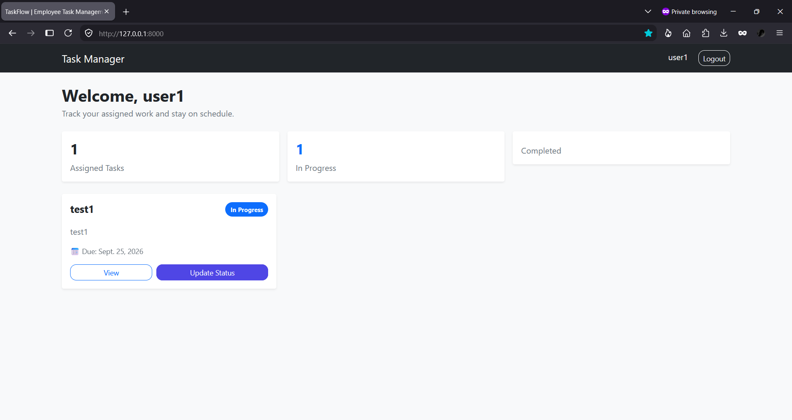

# TaskFlow – Employee Task Management System

A full-stack Django-based Employee Task Management System that enables **Admins**, **Managers**, and **Employees** to collaborate through task assignment, status tracking, and progress updates in a modern, responsive interface.


## Live Demo

🌐 **Live Website:** https://task-management-system-curd-project.onrender.com

## Features

### Admin

- Manage users and system roles
- Access the Django Admin Panel
- Monitor system-wide operations

### Manager

- Create and assign tasks
- Manage employee workloads
- Track task progress and updates

### Employee

- View assigned tasks
- Update task status
- Submit task remarks

### General

- Role-based authentication
- CRUD task management
- Activity tracking
- Responsive Bootstrap 5 interface
- SQLite database integration

## Tech Stack

| Category | Technology |
|----------|------------|
| **Backend** | Python, Django |
| **Frontend** | HTML5, CSS3, Bootstrap 5 |
| **Database** | SQLite |
| **Version Control** | Git, GitHub |
| **Deployment** | Render |

## Project Preview

### Authentication

| Login |
|-------|
|  |

### Manager

| Dashboard | Task View |
|-----------|-----------|
|  |  |

### Employee

| Dashboard | Task Update |
|-----------|-------------|
|  |  |

### Admin

| Dashboard |
|-----------|
|  |

## Project Structure

```text
task-management-system/
├── core/
├── tasks/
│   ├── migrations/
│   ├── static/
│   │   └── css/
│   ├── templates/
│   │   ├── registration/
│   │   └── tasks/
│   ├── forms.py
│   ├── models.py
│   ├── urls.py
│   └── views.py
├── screenshots/
├── db.sqlite3
├── manage.py
├── requirements.txt
├── README.md
├── LICENSE
└── .gitignore
```

## Installation

1. Clone the repository.

```bash
git clone https://github.com/deepakkv8335/task-management-system.git
cd task-management-system
```

2. Create and activate a virtual environment.

**Windows**

```bash
python -m venv venv
venv\Scripts\activate
```

3. Install dependencies.

```bash
pip install -r requirements.txt
```

4. Run migrations.

```bash
python manage.py migrate
```

5. Start the development server.

```bash
python manage.py runserver
```

Open:

```text
http://127.0.0.1:8000
```

## Demo Accounts

| Role | Username | Password |
|------|----------|----------|
| Admin | `admin` | `admin` |
| Manager | `manager` | `manager` |
| Employee | `user1` | `user1` |

## Future Improvements

- PostgreSQL production database
- Advanced task search and filtering
- Email notifications
- Dashboard analytics
- Mobile-friendly enhancements

## License

This project is licensed under the **MIT License**.

## Author

**Deepak K V**

- 🌐 Portfolio: https://deepakkv8335.github.io
- 💼 LinkedIn: https://www.linkedin.com/in/deepakkv8335
- 💻 GitHub: https://github.com/deepakkv8335
