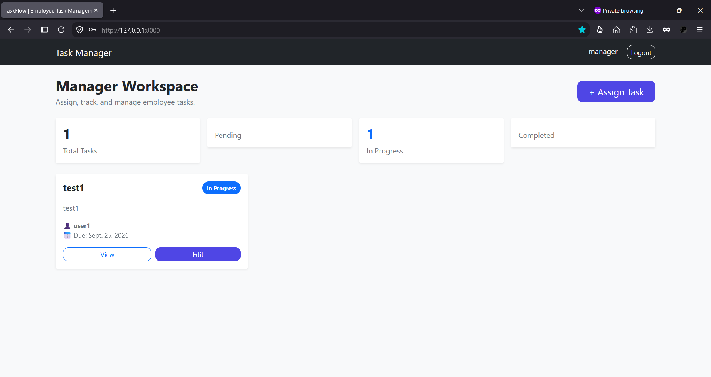
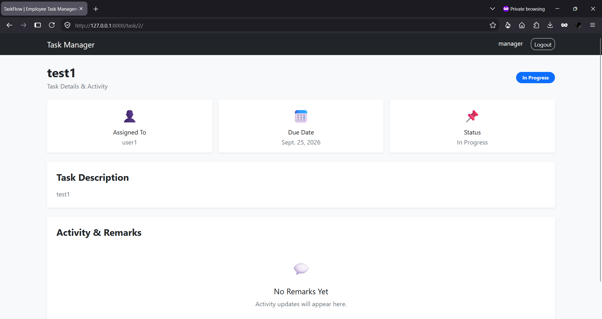
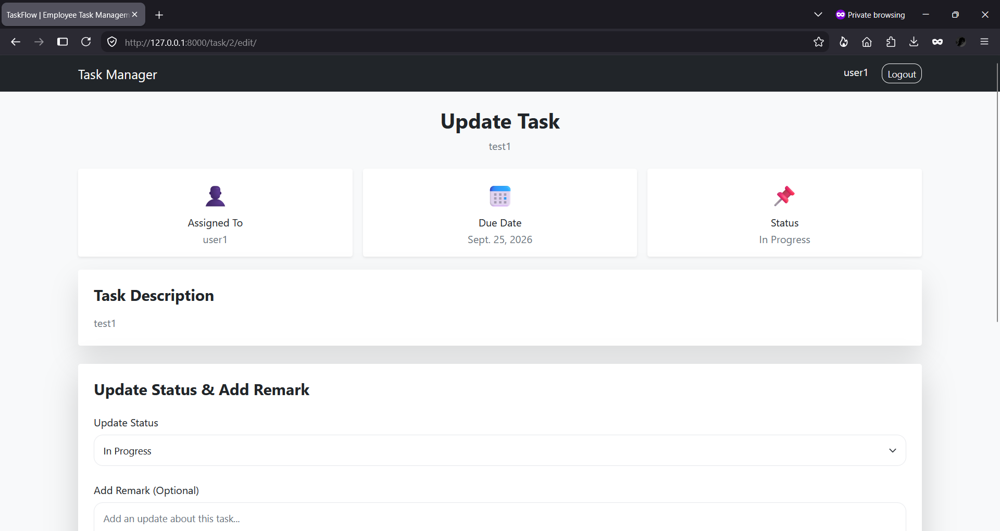
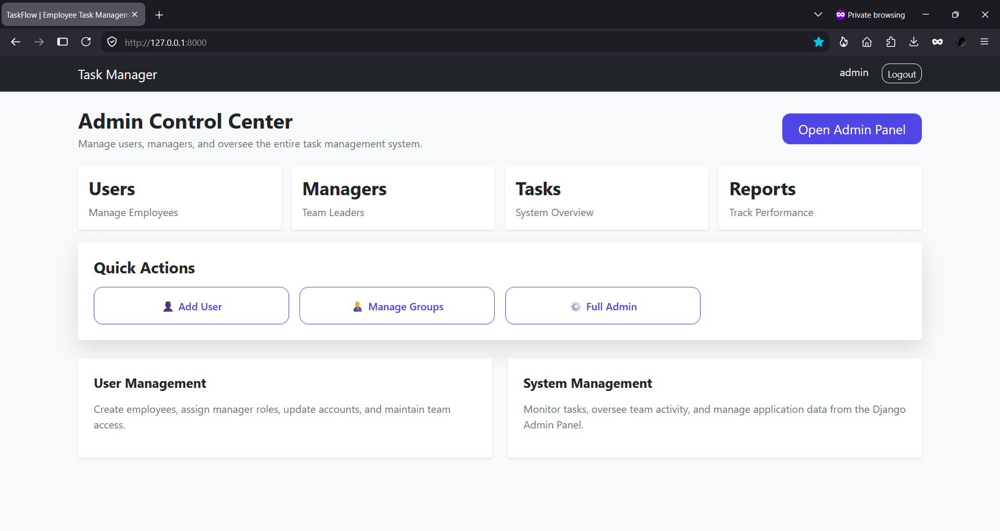

# TaskFlow – Employee Task Management System

A role-based task management web application built with **Python** and **Django** that enables **Admins**, **Managers**, and **Employees** to collaborate through task assignment, status tracking, and progress updates in a modern, responsive interface.

## Live Demo

Coming Soon

## Features

- Role-based authentication (Admin, Manager, Employee)
- Manager task assignment and management
- Employee task status updates
- Task remarks and activity tracking
- Responsive modern UI with Bootstrap
- SQLite database integration
- Django Admin Panel for system management

## Tech Stack

- Python
- Django
- HTML
- CSS
- Bootstrap 5
- SQLite

## Screenshots

### Login


### Manager Dashboard



### Manager Task View



### Employee Dashboard


### Employee Task Update



### Admin Dashboard



## Project Structure

```text
task-management-system/
├── core/
├── tasks/
│   ├── migrations/
│   ├── static/
│   │   └── css/
│   ├── templates/
│   │   ├── registration/
│   │   └── tasks/
│   ├── forms.py
│   ├── models.py
│   ├── urls.py
│   └── views.py
├── screenshots/
├── db.sqlite3
├── manage.py
├── requirements.txt
├── README.md
├── LICENSE
└── .gitignore
```

## Installation

1. Clone the repository.

```bash
git clone https://github.com/deepakkv8335/task-management-system.git
cd task-management-system
```

2. Create and activate a virtual environment.

**Windows**

```bash
python -m venv venv
venv\Scripts\activate
```

3. Install dependencies.

```bash
pip install -r requirements.txt
```

4. Run migrations.

```bash
python manage.py migrate
```

5. Start the development server.

```bash
python manage.py runserver
```

Open `http://127.0.0.1:8000`.

## Default Demo Accounts

| Role | Username | Password |
|------|----------|----------|
| Admin | `admin` | `admin` |
| Manager | `manager` | `manager` |
| Employee | `user` | `user` |
| Employee | `user1` | `user1` |

## Future Improvements

- PostgreSQL production database (Neon)
- Render deployment
- Task search and filtering
- Email notifications
- Dashboard analytics

## Author

**Deepak K V**