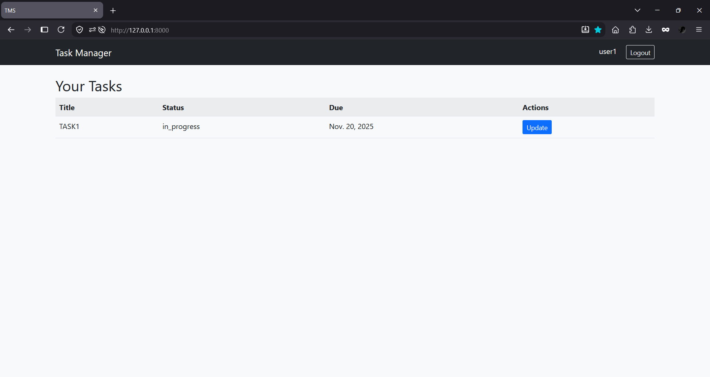
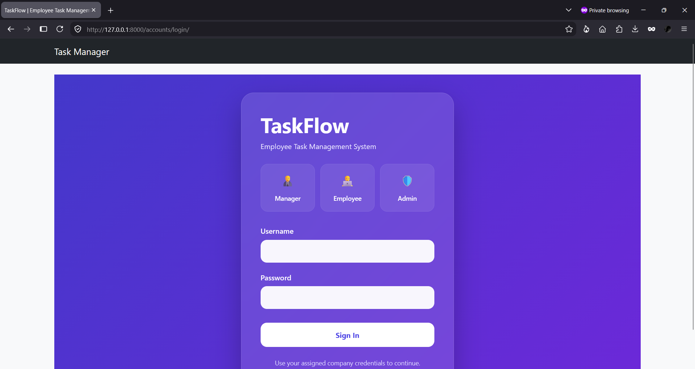
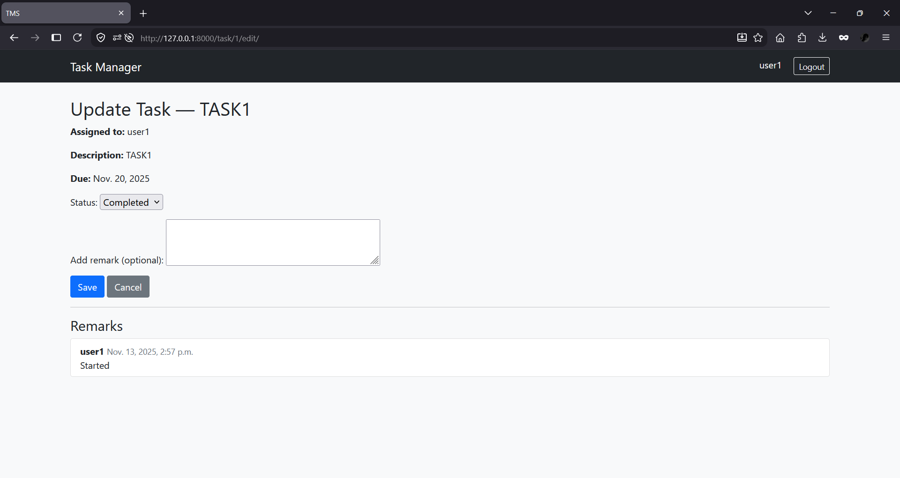

# Task Management System

A web-based task management application built with **Python** and **Django** that helps users create, organize, update, and manage daily tasks through a simple and responsive interface.

## Features

- Create new tasks
- Update existing tasks
- Delete completed tasks
- Responsive user interface
- SQLite database integration

## Tech Stack

- Python
- Django
- HTML
- CSS
- JavaScript
- SQLite

## Screenshots

### Home



### Task List



### Add Task



## Project Structure

```text
task-management-system/
├── app/
├── templates/
├── static/
├── db.sqlite3
├── manage.py
└── requirements.txt
```

## Installation

1. Clone the repository.

```bash
git clone https://github.com/deepakkv8335/task-management-system.git
cd task-management-system
```

2. Create and activate a virtual environment.

**Windows**

```bash
python -m venv venv
venv\Scripts\activate
```

3. Install dependencies.

```bash
pip install -r requirements.txt
```

4. Run migrations.

```bash
python manage.py migrate
```

5. Start the development server.

```bash
python manage.py runserver
```

Open `http://127.0.0.1:8000`.

## Future Improvements

- User authentication
- Task categories
- Due dates and reminders
- Search and filtering

## Author

**Deepak K V**
